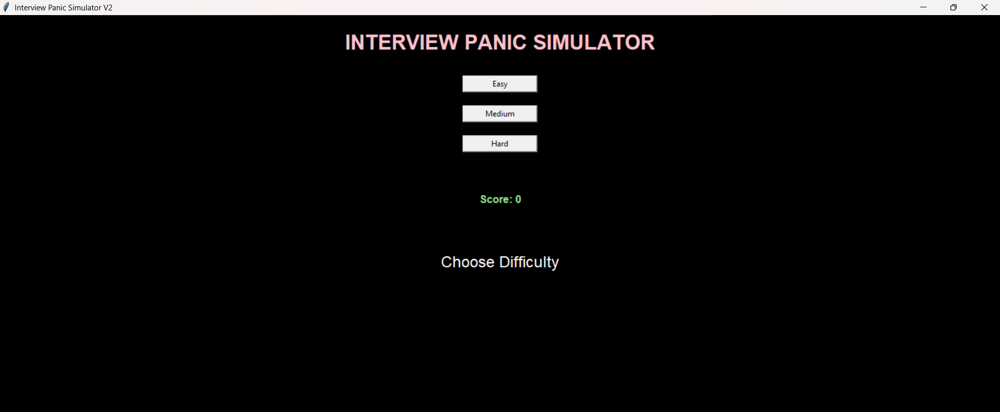
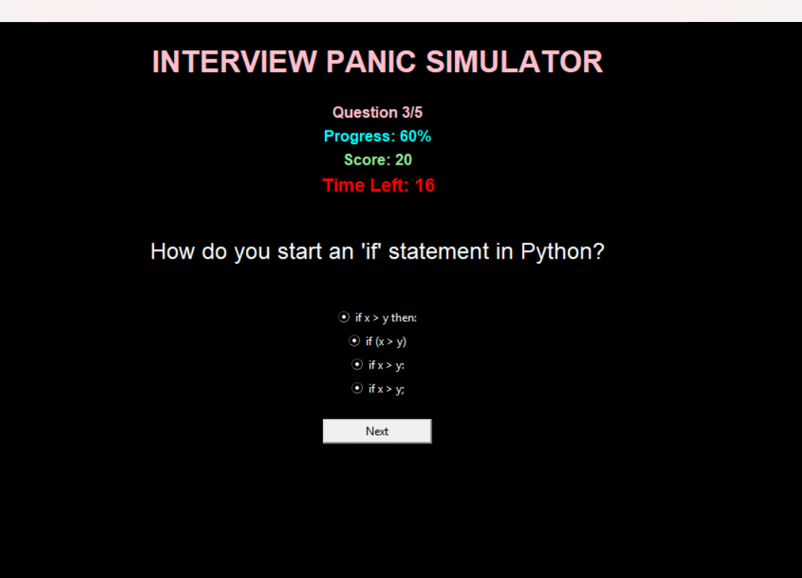
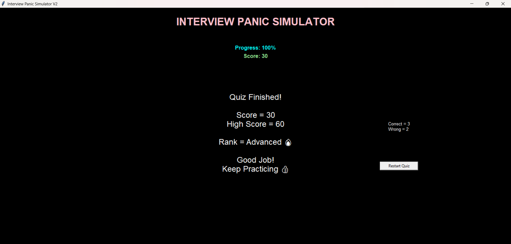

# Interview-Panic-Simulator-V2
A Python Tkinter-based interview preparation quiz application featuring multiple-choice questions, score tracking, progress monitoring, performance rankings, restart functionality, and high-score persistence.

A Python-based GUI application that simulates a technical interview environment.

## Screenshots

### Home Screen


### Quiz Screen


### Result Screen


## Features

* Multiple-choice interview questions
* Real-time score tracking
* Progress indicator
* Performance ranking system
* High score tracking
* Restart quiz functionality
* Clean dark-themed interface

## Technologies Used

* Python
* Tkinter

## How to Run

```bash
python main.py
```

## Author

Tina Florip
